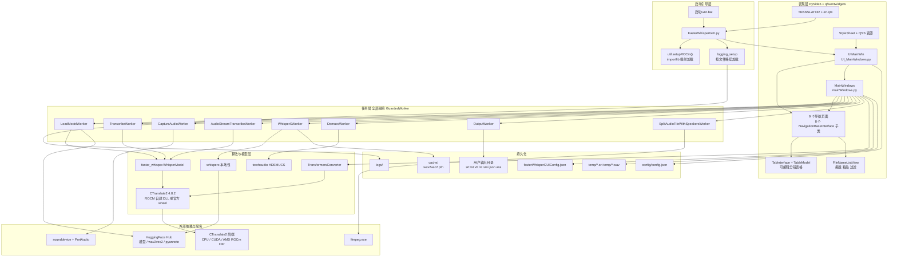
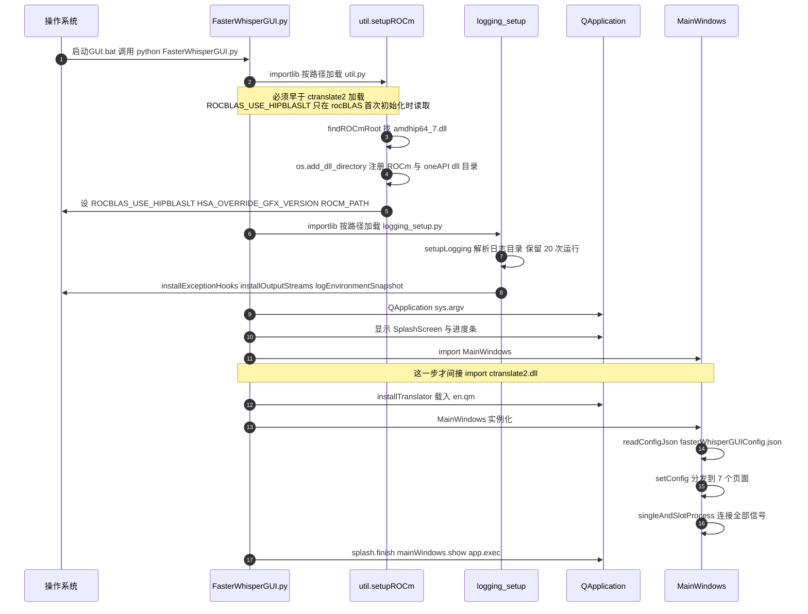
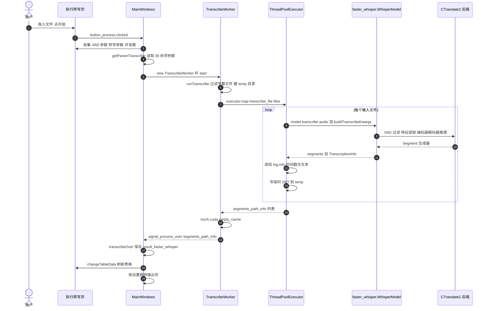
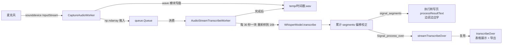
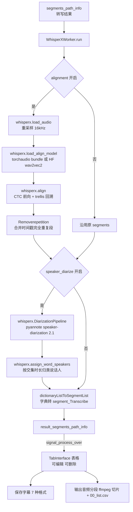
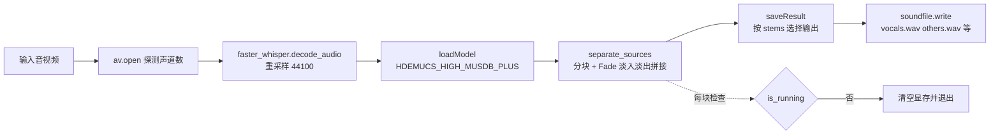
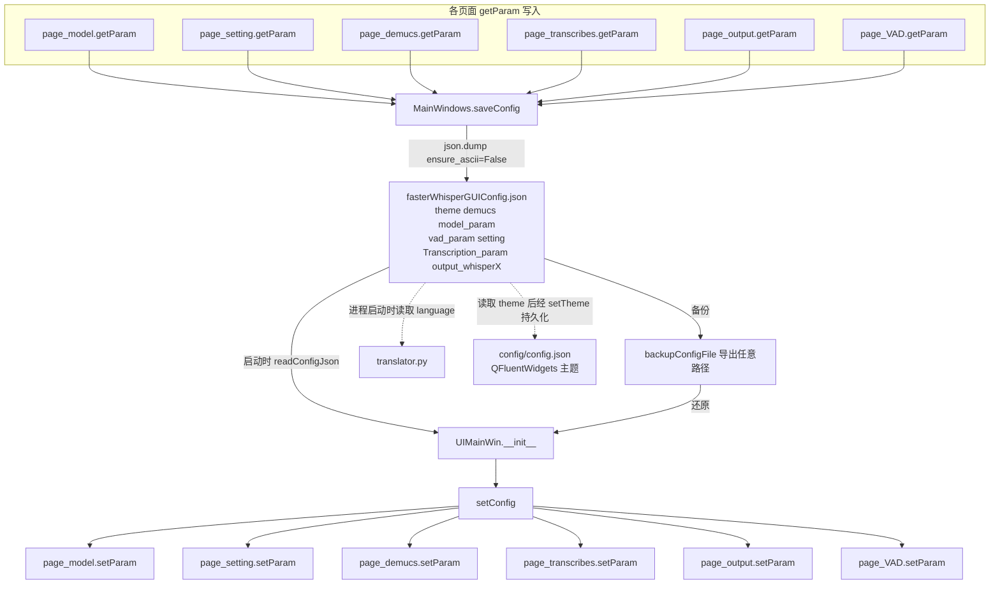
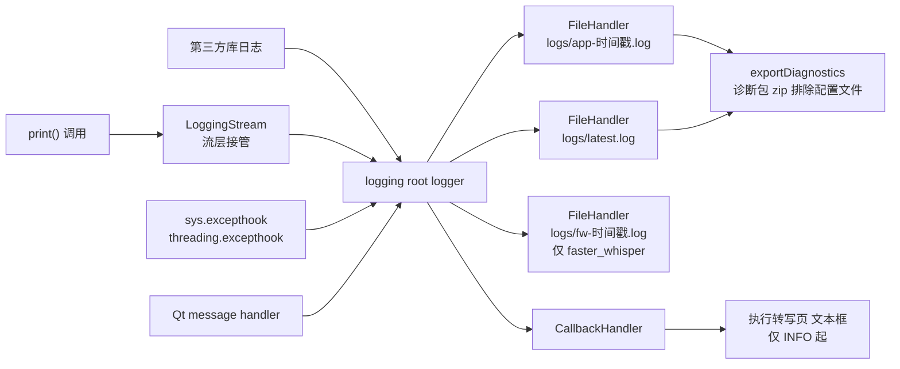
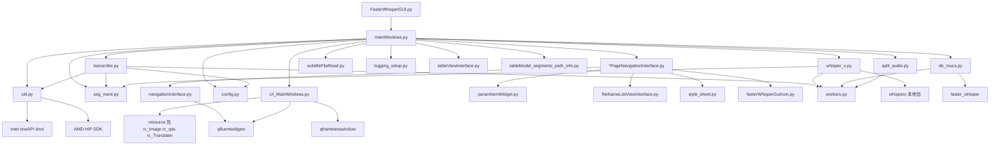

# faster-whisper-GUI 技术栈 · 功能点 · 数据流

> 版本基线：`faster_whisper_GUI/version.py` → `__version__ = 0.8.5`，
> `faster-whisper 1.1.0`、`whisperX 3.1.1`、`Demucs v4.0`。
> 本文由源码逐文件核对得出（非照抄 README），关键结论均标注 `文件:行号`。

---

## 一、技术栈

### 1.1 总览

| 层次 | 技术 | 作用 | 出处 |
|---|---|---|---|
| 语言/运行时 | Python `>=3.12,<3.15` | 上限卡在 3.15：`ctranslate2`/`torch`/`onnxruntime` 均无 cp315 wheel，AMD ROCm torch 止步 cp314 | `pyproject.toml:23` |
| 依赖管理 | **uv** + `pyproject.toml` + `uv.lock`（取代旧 `requirements.txt`） | 精确同步、可复现 | `pyproject.toml:1-14` |
| GUI 框架 | **PySide6 ≥ 6.10.2**（Qt 6） | 全部界面 | `pyproject.toml:27` |
| GUI 组件库 | **PySide6-Fluent-Widgets ≥ 1.3.2** | `NavigationInterface` / `InfoBar` / `StateToolTip` / `ComboBox` / `SwitchButton` / `MessageBox` | `pyproject.toml:28` |
| 无边框窗口 | **PySideSix-Frameless-Window ≥ 0.8.0**（`qframelesswindow.FramelessMainWindow`） | 主窗体与自绘标题栏 | `pyproject.toml:29`、`UI_MainWindows.py:81` |
| ASR 推理引擎 | **CTranslate2 `==4.8.2`** | Whisper 的量化推理后端 | `pyproject.toml:35` |
| ASR 封装 | **faster-whisper `==1.2.1`** | `WhisperModel.transcribe()` / `decode_audio()` / Silero VAD | `pyproject.toml:37` |
| 音视频解码 | **PyAV**（`av`）+ `ffmpeg-python`；外部 ffmpeg.exe | 音频流探测、重采样、按片段切片 | `pyproject.toml:38-39`、`split_audio.py:32` |
| 张量/深度学习 | **torch `2.15.0a0+rocm10.2.0a20260926`**（AMD TheRock nightly）、**torchaudio `2.11.0`**（PyPI CPU 构建） | wav2vec2 对齐、Demucs、pyannote | `pyproject.toml:45-51` |
| 说话人日志 | **pyannote.audio ≥ 4.0** | VAD 分割模型 + `pyannote/speaker-diarization@2.1` 声纹聚类 | `pyproject.toml:52`、`whisperx/diarize.py:12` |
| 强制对齐 | **transformers ≥ 4.23**（`Wav2Vec2ForCTC` / `Wav2Vec2Processor`）+ torchaudio bundles | 词级时间戳 | `whisperx/alignment.py:70-87` |
| 人声分离 | **Demucs v4 `HDEMUCS_HIGH_MUSDB_PLUS`**（torchaudio.pipelines） | 4 轨音乐源分离 | `de_mucs.py:7,266` |
| 数值/数据 | numpy、pandas | 波形数组、说话人 DataFrame | `pyproject.toml:56-57` |
| 音频 IO | **sounddevice**（PortAudio 绑定）、soundfile、wave | 麦克风采集与 wav 写盘 | `pyproject.toml:63-64` |
| 文本处理 | nltk、**opencc-python-reimplemented**、webvtt-py | 句子切分、简繁转换、VTT 解析 | `pyproject.toml:66-68` |
| 模型转换 | `ctranslate2.converters.TransformersConverter` | HF Whisper → CT2 本地模型 | `convertModel.py:8,67` |
| 模型下载 | HuggingFace Hub（`download_root` / `cache_dir` / `use_auth_token`） | 模型与 wav2vec2/pyannote 权重 | `modelLoad.py:98-107` |
| 配置持久化 | 单个 JSON（`fasterWhisperGUIConfig.json`）+ Qt 主题库 `config/config.json` | 7 个配置段 | `mainWindows.py:1804-1820` |
| 日志 | 标准 `logging` + 自研 `logging_setup` | 每次运行独立文件、保留 20 次、诊断包 zip | `docs/LOGGING.md`、`logging_setup.py:49-53` |
| i18n | `QTranslator` + 资源内嵌 `en.qm`（源文件 `en.ts`） | 中文默认 / 英文可选 | `translator.py:30-42` |
| 资源系统 | Qt `.qrc` → `resource/_rc/rc_Image.py`、`rc_qss.py`、`rc_Translater.py` | 图标、QSS、翻译 | `resource/_rc/` |
| 环境搭建 | `setup.ps1`（PowerShell）、`启动GUI.bat` | uv sync + 放置 ROCm DLL + 校验 | `setup.ps1` |

### 1.2 关键"钉子"及其原因

> ⚠️ **依赖与代码曾经不一致（在 `.venv` 中实测确认；第 1、2 条已修复，见 7.1）**
>
> 1. ~~`whisperx/diarize.py:19` 调用 `Pipeline.from_pretrained(..., use_auth_token=…)`，但装着的 **pyannote.audio 4.0.7 已移除该参数**（签名只剩 `checkpoint, revision, hparams_file, subfolder, token, cache_dir`）→ 抛 `TypeError`，说话人分离不可能成功。~~ **已修复**：新增 `_load_pipeline()` 按签名在 `token` / `use_auth_token` 间选择。
> 2. ~~`whisperx/asr.py:95` 用 21 个键构造 `TranscriptionOptions`，而 **faster-whisper 1.2.1 的该 dataclass 有 26 个必填字段** → `TypeError`，`whisperx.load_model()` 与 `python -m whisperx` 是坏的。~~ **已修复**：补齐 5 个字段。
> 3. 直接 `import whisperx` / `import faster_whisper` 会因 `ctranslate2.dll` 找不到依赖而 `FileNotFoundError` —— 这正是 `FasterWhisperGUI.py` 必须先用 `importlib` 提前跑 `setupROCm()` 的原因；只有走那个入口才能正常导入。**（仍存在，属设计约束，见 7.2）**

| 钉子 | 为什么不能动 |
|---|---|
| `ctranslate2==4.8.2` | 与**自建 ROCm 版 `ctranslate2.dll`** 严格配对：DLL 由 CTranslate2 v4.8.2 源码编译，Python 侧 `_ext.*.pyd` 来自官方 4.8.2 wheel。升级必须先重建 DLL（`pyproject.toml:32-35`、`setup.ps1:77-89`） |
| `faster-whisper==1.2.1` | 代码使用 VAD 参数名 `threshold`；0.10.0/1.0.0 用 `onset`，不兼容（`pyproject.toml:36`） |
| `torch==2.15.0a0+rocm10.2.0a20260926` | AMD ROCm torch 只有 nightly 预发布版，不钉会每天跳到新版本（`pyproject.toml:41-45`） |
| `torchaudio==2.11.0`（走 PyPI 索引） | 跨索引择优会让 TheRock 的 `2.11.0.3+rocm…` 胜出，那是未验证路径（`pyproject.toml:46-51,158`） |
| `sounddevice` 而非 PyAudio | PyAudio 只发 `cp3X` wheel，Python 3.14 因此被卡；sounddevice 是纯 Python wheel + 捆绑 PortAudio DLL（`pyproject.toml:58-62`） |
| `prerelease = "allow"` + `constraint-dependencies` 钉 `einops`/`safetensors`/`defusedxml`/`hf-xet` | allow 是钝器，会让其它包选到 rc/dev 版；用精确钉版拉回已验证环境（`pyproject.toml:82-101`） |
| `override-dependencies = ["triton; sys_platform == 'linux'"]` | AMD torch 把只发 Linux 的 triton 声明为无平台标记必需依赖，Windows 上 `uv sync` 会失败（`pyproject.toml:107-114`） |
| `index-strategy = "unsafe-best-match"` | TheRock 也镜像 filelock/fsspec 等通用包，默认策略会取到 PyPI 旧版（`pyproject.toml:103-105`） |

### 1.3 AMD ROCm / HIP 适配（本项目最有辨识度的部分）

四层适配，全部集中在 `faster_whisper_GUI/util.py:104-281`，且**必须在 `import ctranslate2` 之前完成**（`FasterWhisperGUI.py:18-40` 用 `importlib` 按文件路径提前加载 `util.py`，绕开包 `__init__.py`）：

1. **DLL 目录注册** — `findROCmRoot()` 按 `自带 bin/` → `ROCM_PATH`/`HIP_PATH` → `C:\Program Files\AMD\ROCm\<ver>` 顺序找含 `bin\amdhip64_7.dll` 的根；`findDependentDllDirectories()` 再补 Intel oneAPI 的 `dnnl.dll`/`sycl8.dll`/`tbb12.dll` 目录；逐个 `os.add_dll_directory()` 并追加 `PATH`。
2. **`ROCBLAS_USE_HIPBLASLT=1`** — HIP SDK 给 hipBLASLt 编了 gfx1103 内核却没给 rocBLAS 编，否则报 `Cannot read .../rocblas/library/TensileLibrary.dat ... for GPU arch : gfx1103`。该开关是从 rocblas.dll 字符串表里挖出来的，非公开接口（`util.py:71-75`）。
3. **`HSA_OVERRIDE_GFX_VERSION=11.0.0`** — 把 gfx1103 上报成同属 RDNA3/wave32 的 gfx1100，复用已有内核，实测再快约 1.5 倍（`util.py:97-101`）。
4. **设备名映射** — 下拉框显示 `AMD ROCm (HIP)`、`value = "rocm"`，真正传给 CTranslate2 的是 `"cuda"`（HIP 后端是 CUDA 后端源码用 HIP 重编，API 命名完全沿用）；映射在 `MainWindows.getParam_model()` 完成（`config.py:139-167`、`mainWindows.py:256-295`）。

> 状态跨模块传递用**进程级环境变量** `FASTER_WHISPER_GUI_ROCM_AVAILABLE`，因为启动引导会产生第二份 `util` 模块实例（`util.py:84-93,274-281`）。

---

## 二、功能点（按页面 / 模块归集）

主窗体共 9 个页面，在 `UI_MainWindows.py:276-321` 注册（`addSubInterface` → `stackedWidget` + 左侧 `pivot`）。其中 8 个继承 `NavigationBaseInterface`（`navigationInterface.py:147`），"关于"页直接继承 `ScrollArea` 并用 `stackedWidget.addWidget` 挂载（`UI_MainWindows.py:304-306`）。

### 2.1 主页 Home
`homePageNavigationInterface.py`、`homePageItemLabel.py`
- 三张功能卡片直达：**Demucs 声乐分离**、**faster-whisper 执行转写**、**WhisperX 及字幕编辑**（`mainWindows.py:1614-1617`）。

### 2.2 声乐分离（Demucs）
`demucsPageNavigationInterface.py` + `de_mucs.py:22-359`
- `HDEMUCS_HIGH_MUSDB_PLUS` 4 轨分离，可输出：**All Stems / Vocals / Other / Bass / Drums / Vocals 与 Others 二分**（`config.py:219-226`）。
- 参数：`采样重叠度`、`分段长度(s)`、`输出音轨`。**界面默认**（`demucsPageNavigationInterface.py:81,98,115`）为 overlap `0.10` / segment `10` s / 音轨索引 1（仅人声）；**当前配置文件里保存的**是 overlap `0.1` / segment `7.8` / tracks `5`（`fasterWhisperGUIConfig.json:3-7`）——两者不一致，因为配置会在退出时覆盖界面默认值。
- 分离用的模型权重路径**硬编码**为 `./cache/hdemucs_high_trained.pt`（`mainWindows.py:1469`），不随输出目录或设置变化；该路径同时是 torchaudio 的下载目标——`HDEMUCS_HIGH_MUSDB_PLUS.get_model()` 内部走 `_download_asset`，文件缺失时从 torch.hub 下载（`de_mucs.py:266-276`）。
- 分块 + `torchaudio.transforms.Fade` 线性淡入淡出拼接，避免边界爆音（`de_mucs.py:214-254`）。
- 输入用 PyAV 探测声道（单声道不拆分），`faster_whisper.decode_audio` 重采样到 44.1 kHz（`de_mucs.py:284-303`）。
- 输出 `soundfile.write` 写 `<原文件名>_<stem>.wav` 到独立目录（`de_mucs.py:305-358`）。
- 逐文件状态回报 `file_process_status` 信号：`load model → resample audio → separate sources → save files → file over`。

### 2.3 模型参数（加载 / 下载 / 转换）
`modelPageNavigationInterface.py` + `modelLoad.py` + `convertModel.py`
- **模型来源**：本地目录 或 在线模型名（`localModel` / `onlineModel` 开关）。
- **模型名** 16 项：tiny → large-v3、large-v3-turbo、distil-large-v3/v2、distil-medium.en、distil-small.en（`config.py:118-135`）。
- **计算精度** 7 项：int8、int8_float16、int8_bfloat16、int16、float16、float32、bfloat16（`config.py:109-116`）。
- **设备** cpu / cuda / auto / AMD ROCm (HIP)（`config.py:152-164`）。
- `cpu_threads`、`num_workers`（并发线程数）、`device_index`、`download_root`、`local_files_only`（`modelLoad.py:98-107`）。
- **V3 模型 mel 滤波器修正**：`use_v3_model=True` 时把 `mel_filters` 改成 128 维，且必须 `.astype("float32")`，否则 `StorageView.from_array()` 报 `Unsupported type: <f8`（`modelLoad.py:60-76`）。
- **模型转换（当前版本被禁用）**：代码链路完整 —— `TransformersConverter` + `quantization`，优先用本地 HF 缓存（`models--openai--whisper-<name>/snapshots/<hash>`），否则下载 `openai/whisper-<name>`，跑在 `threading.Thread(daemon=True)` 上（`convertModel.py:19-99`、`mainWindows.py:963-993`）。但界面上 `hBoxLayout_model_convert` 的 `addLayout` 被注释掉（`modelPageNavigationInterface.py:320`），三个控件全部 `setEnabled(False)`（`:325,330,336`），**入口在当前版本不可达**。
- 模型状态通过 `LoadModelWorker.setStatusSignal` 同时接到 `loadModelResult` 与 `setModelStatusLabelTextForAll`，刷新所有页面的状态标签（`mainWindows.py:250-252`）；`statusToolsSignalStore.LoadModelSignal` 是同一对回调的复用处（`mainWindows.py:1600-1601`）。
- **线程数与下载**：`num_workers` 最终成为 CTranslate2 的 `inter_threads`，`cpu_threads` 成为 `intra_threads`（`modelLoad.py:98-107`）；下载走 `huggingface_hub.snapshot_download(repo_id, cache_dir=download_root, local_files_only=…)`，源码中**没有**自行实现的 urllib/requests 下载逻辑。
- **卸载模型**按钮（`mainWindows.py:1511`）：转写进行中会被拦下，温度回退序列不为 `"0"` 时会额外告警，卸载后清 `torch.cuda.empty_cache()`。

### 2.4 人声活动检测（VAD）
`vadPageNavigationInterface.py` + `mainWindows.py:932-962`
- `use_VAD` 开关；Silero VAD 参数：`threshold`（0.2）、`minSpeechDuration`（0）、`minSilenceDuration`（2000 ms）、`maxSpeechDuration`（inf）、`speechPad`（400 ms）（`fasterWhisperGUIConfig.json:22-29`、`util.py:14-20`）。
- **易踩的坑**：`util.py:14` 的 `VADParameters` / `util.py:22` 的 `WhisperParameters` 是**标注用 TypedDict**——类体里的值不是运行期默认值，`VADParameters()` 实际返回 `{}`（已实测）。真正的默认值只在界面控件的初始值里，以及 `getVADparam()` / `getParamTranscribe()` 构造运行时字典时给出。

### 2.5 转写参数
`tranccribePageNavigationInterface.py`（约 44 KB，参数最密集的页面）+ `mainWindows.py:746-904`
- **语言**：`Language_dict` **101** 种（`config.py:5-107`），`Language_without_space = ["ja","zh","ko","yue"]` 控制分词显示。
- **任务**：`transcribe` / `translate`（`config.py:137`）。
- 完整 faster-whisper 解码参数：`beam_size`、`best_of`、`patience`、`length_penalty`、`temperature`（逗号分隔序列）、`compression_ratio_threshold`、`log_prob_threshold`、`no_speech_threshold`、`condition_on_previous_text`、`initial_prompt`、`prefix`、`suppress_blank`、`suppress_tokens`、`without_timestamps`、`max_initial_timestamp`、`word_timestamps`、`prepend_punctuations`、`append_punctuations`、`repetition_penalty`、`no_repeat_ngram_size`、`prompt_reset_on_temperature`、`chunk_length`、`max_new_tokens`、`clip_timestamps`、`hallucination_silence_threshold`、`hotwords`、`language_detection_threshold`、`language_detection_segments`（`fasterWhisperGUIConfig.json:39-73`）。
- **`clip_mode`**：切片模式的解析在 `getClipTimestamps()`（`mainWindows.py:905`）。
- 参数的唯一出口是 `buildTranscribeKwargs()`（`transcribe.py:52-94`），文件转写与实时转写共用，避免两处漂移。
- 中文文档：`参数说明：.md`。

### 2.6 执行转写
`processPageNavigationInterface.py` + `fileNameListViewInterface.py` + `transcribe.py`
- **两种模式**（单选）：`转写文件` / `音频采集`（`processPageNavigationInterface.py:44-52`）。
- **文件列表**：拖拽、文件夹递归扫描、Ctrl+V 粘贴路径、键盘 Delete 删除；自动过滤字幕文件与无音轨文件并弹 InfoBar 说明原因（`fileNameListViewInterface.py:71-176,285-357`）。
- **音频采集参数** 4 档预设（声道/位深/采样率/音质）（`config.py:196-217`）。
- **并发批量**：`ThreadPoolExecutor(num_workers)`，`executor.map(self.transcribe_file, files)`（`transcribe.py:575-576`）；`num_workers` 解析失败时回退 1 并记 WARNING（`mainWindows.py:463-469`）。
- **实时转写**：`CaptureAudioWorker`（sounddevice 采集 → `queue.Queue` + wav 落盘）与 `AudioStreamTranscribeWorker`（每 **30 秒**一块滚动转写）双线程；30 s 是实测最优值——8s/15s/30s 分块的字符相似度为 83% / 70% / **100%**（`mainWindows.py:92-102`、`transcribe.py:97-254`）。
- **进度输出**：`processResultText`（QTextEdit）同时是日志的 GUI 出口（`mainWindows.py:182-198`）。
- **取消**：二次点击按钮 → `MessageBox` 确认 → `stop()`。取消是**协作式**的：各 Worker 的 `is_running` 布尔量在循环里被检查（`transcribe.py:472,581`）；`requestInterruption()` 是无效死调用，已全部移除（见 7.1）。
- 每个文件转写完先写一份**临时 SRT** 到 `./temp`（`transcribe.py:595-598`）。

### 2.7 WhisperX 及字幕编辑
`outputPageNavigationInterface.py` + `tableViewInterface.py` + `tableModel_segments_path_info.py` + `whisper_x.py`
- **WhisperX 时间戳对齐**：wav2vec2 音素级强制对齐（`whisper_x.py:59-100`）。
- **WhisperX 说话人分离**：声纹聚类，可设**最少/最大声源数**（`whisper_x.py:106-164`、`outputPageNavigationInterface.py:112-132`）。该功能此前因 pyannote.audio 4.0.7 移除 `use_auth_token` 而必然抛 `TypeError`，**已修复**（详见 7.1）。仍需在「设置」页填 HuggingFace 令牌——`pyannote/speaker-diarization@2.1` 是 gated 仓库，没令牌只能拿到鉴权错误。
- **输出音频分段**：按说话人+时间戳用 ffmpeg 切片，并生成 `00_list.csv` 标注（`vocal_path, speaker_name, language, text`）（`split_audio.py:51-106`）。
- **多标签表格**：每个输入文件一个可编辑标签页；`TableModel` 可改 `start/end/text`（`tableModel_segments_path_info.py:84-147`）；标签可拖动/滚动/阴影/最大宽度/关闭模式（配置文件 `output_whisperX` 段）。
- **保存字幕文件**，格式 `ALL` 或单选 7 种：**ASS / JSON / LRC / SMI / SRT / TXT / VTT**（`config.py:194`、`transition` 见 `transcribe.py:614-640`）。
- **输出编码** 5 种：UTF-8、UTF-8 BOM、GBK、GB2312(gb18030)、ANSI（`config.py:228-233`）；下拉框**默认索引 1 = UTF-8 BOM**（`outputPageNavigationInterface.py:146-147`）。注意 `"ANSI"` 映射到 Python 的 `mbcs`，实际字节随系统区域设置变化。
- **词级时间戳的落点**：仅 **VTT / LRC / SMI / JSON** 会写 `segment.words`——VTT 用行内 `<HH:MM:SS.mmm>` 标签，LRC 用行内 `<MM:SS.xx>` 逐字标签，SMI 用 ``，JSON 用 `words[]` 数组（`transcribe.py:705`）；**SRT / TXT / ASS 不输出词级时间戳**。
- 输出文件名由 `getSaveFileName()` 复用源文件名并把最后一个扩展名换成目标格式；`"ALL"` 会一次性写出全部 7 种（`transcribe.py:392-395,1000-1012`）。
- **简繁转换**：`opencc.OpenCC('t2s')` / `('s2t')`（`mainWindows.py:658-695`）。
- **加载已有结果**：`readSRTFileToSegments` / `readJSONFileToSegments`（`subtitleFileRead.py:12,38`）。
- **删除结果标签**时同步清理四份结果缓存（`mainWindows.py:1688-1730`）。

### 2.8 设置
`settingPageNavigation.py`
- `saveConfig`（退出时保存）、`autoLoadModel`（启动即加载）、`autoGoToOutputPage`、`autoClearTempFiles`（退出清理 `temp/*.srt`）、界面语言 `language`、主题色 `themeColor`、26 套预设主题色（`config.py:235-262`）。
- **HuggingFace user token**（说话人分离需要）（`settingPageNavigation.py:288-312`）。
- **日志入口**：打开应用日志 / faster-whisper 日志 / 日志目录 / **导出诊断包**（`settingPageNavigation.py:237-272`）。
- **配置备份与还原**：`backupConfigFile` / `loadBackupConfigFile`（`mainWindows.py:1633-1675`）。

### 2.9 关于页
`aboutPageNavigationInterface.py` — 版本信息、`ImageViewer`、捐赠图。侧边栏底部头像也指向它（`UI_MainWindows.py:310-316`）。

### 2.10 横切能力

| 能力 | 实现 |
|---|---|
| **线程异常护栏** | `GuardedWorker`（`workers.py:80-105`）：`__init_subclass__` 在类定义时自动把 `run()` 包一层，异常必定 `log.critical` + 完整 traceback + `onError()` 回调 + `failed` 信号，**调用点无法遗忘** |
| **日志系统** | 每次启动独立文件 `app-<stamp>.log` / `fw-<stamp>.log` + 固定 `latest.log`，保留 20 次；目录三级回退（程序目录 → `%LOCALAPPDATA%` → 临时目录）；`print()` 由 `LoggingStream` 在流层接管；`sys.excepthook` + `threading.excepthook` + Qt message handler 全接（`logging_setup.py`、`docs/LOGGING.md`） |
| **诊断包** | `exportDiagnostics()` 打 zip，**显式排除含 HF token 的配置文件**（`logging_setup.py:566`、`docs/LOGGING.md:69-73`） |
| **环境快照** | `environmentSnapshot()` 只读环境变量、不联网、不导入 `ctranslate2`（避免为打印版本号提前加载 DLL） |
| **i18n** | `translator.py` 按 `setting.language` 载入 `:/resource/Translater/en.qm`，各页面用 `self.tr()` |
| **主题/QSS** | `StyleSheet` 枚举 13 个 QSS 项，按 `_light.qss` / `_dark.qss` 自动选路径（`style_sheet.py:13-33`） |
| **自检工具** | `tools/check_logging.py`（34 项）、`tools/check_workers.py`、`tools/convert_prints.py`（AST 改写 print → log） |

---

## 三、数据流

### 3.1 分层总览

### 3.2 启动引导时序（顺序有硬性要求）

### 3.3 文件转写主链路

### 3.4 实时麦克风转写

### 3.5 WhisperX 后处理

### 3.6 Demucs 声乐分离

### 3.7 配置持久化

### 3.8 日志管道（一份数据、多个出口）

> 设计要点：**文件那一份永远不经过界面**。旧实现把 `sys.stdout` 换成 Qt 信号对象，导致"信号没派发 = 日志也没了"（`docs/LOGGING.md:94-96`）。

---

## 四、模块依赖图

---

## 五、关键文件索引

| 文件 | 行数级 | 职责 |
|---|---|---|
| `FasterWhisperGUI.py` | 238 行 | 启动引导：ROCm 环境 → 日志 → QApplication → Splash → MainWindows |
| `faster_whisper_GUI/mainWindows.py` | **1829 行** | 控制中枢：参数收集、信号连接、结果展示、配置读写、进程生命周期 |
| `faster_whisper_GUI/tranccribePageNavigationInterface.py` | 799 行 / 44 KB | 转写参数页（30+ 控件） |
| `faster_whisper_GUI/transcribe.py` | 1020 行 | 转写 Worker、实时流、采集、字幕写出（7 格式）、ffmpeg 前处理 |
| `faster_whisper_GUI/tableViewInterface.py` | 720 行 | `TabInterface`：多文件标签 + 可编辑表格 + 参数面板 |
| `faster_whisper_GUI/UI_MainWindows.py` | 351 行 | 窗体骨架：导航枢、QStackedWidget、页面注册、配置分发 |
| `faster_whisper_GUI/logging_setup.py` | 587 行 | 日志目录/Handler/异常钩子/Qt 消息/环境快照/诊断包 |
| `faster_whisper_GUI/util.py` | 367 行 | ROCm 探测与启用、时间戳换算、参数 TypedDict |
| `faster_whisper_GUI/workers.py` | 105 行 | `GuardedWorker`：QThread 统一异常护栏 |
| `faster_whisper_GUI/de_mucs.py` | 359 行 | Demucs 分离 Worker |
| `faster_whisper_GUI/whisper_x.py` | 223 行 | 对齐 + 说话人分离 Worker |
| `faster_whisper_GUI/config.py` | 265 行 | 语言表、模型名、精度、设备、字幕格式、编码、主题色、采集预设 |
| `whisperx/`（本地包） | 12 个模块 | asr / alignment / diarize / vad / audio / utils / SubtitlesProcessor / conjunctions |
| `setup.ps1` + `启动GUI.bat` | 210 + 42 行 | 环境搭建与启动 |
| `docs/LOGGING.md` | 158 行 | 日志与持久化设计说明 |
| `参数说明：.md` | 99 行 | faster-whisper 全部参数的官方语义中文说明 |

---

## 六、值得注意的设计取舍

1. **参数只有一份出口** —— `buildTranscribeKwargs()` 被文件转写和实时转写共用，30 余个参数不会在两处漂移（`transcribe.py:52-58`）。
2. **异常护栏靠 `__init_subclass__` 自动生效** —— 不是靠开发者记得给 `run()` 包 try，而是类定义时就改写，调用点无法绕过（`workers.py:94-98`）。
3. **日志的"已配置"状态挂在 root logger 属性上** —— 因为 `logging_setup` 会被加载成两份模块实例，用模块变量判断会二次 `mode="w"` 清空刚写的日志（`docs/LOGGING.md:149-158`）。
4. **ROCm 状态用环境变量而非模块变量** —— 同理，`util` 也有两份实例（`util.py:84-93`）。
5. **实时转写块长 30 s 是实测结论**，不是经验值（`mainWindows.py:92-102`）。
6. **Demucs 是一条独立支线**，不在转写链路里：它只从声乐分离页被调用（`mainWindows.py:1427-1489`），转写流程从不触发它。要用分离后的人声去转写，得先分离、再把产出的 `*_vocals.wav` 手动加进转写文件列表。
7. **两套并存的参数形态**：页面 `getParam()` 返回 JSON 友好的**字符串/索引**（如 `temperature: "0.0,0.2,…"`），`MainWindows.getParamTranscribe()` 再从同一批控件产出**带类型的运行时字典**；而 `WhisperParameters` 没有运行期默认值，运行时字典少一个键就会在 `buildTranscribeKwargs` 处直接 `KeyError`（`transcribe.py:60-91`）。
8. **命名不一致**：Demucs 的参数持久化时叫 `tracks`，运行时叫 `stems`（`demucsPageNavigationInterface.py:157` vs `mainWindows.py:1503-1504`）。

---

## 七、缺陷与死代码

### 7.1 本次已修复（`git diff` 可逐条核对）

| 严重度 | 位置 | 问题 | 修复 |
|---|---|---|---|
| **崩溃** | `mainWindows.py` `loadBackupConfigFile` | except 里调用**从未定义**的 `self.raiseErrorBar(...)` → 抛 `AttributeError`，把真正的失败原因盖掉 | 改用已定义的 `raiseErrorInfoBar`，并先 `log.error(..., exc_info=True)` 记下原始异常 |
| **崩溃** | `mainWindows.py` `simplifiedAndTraditionalChineseConvert` | 只在 `Auto/zhs/zht` 下绑定 `cc`；「音频识别为中文、但用户选了粤语等语言」时 `cc.convert` 抛 `UnboundLocalError`，调用点无 try/except，直接打断结果展示 | 未知语言显式跳过并记 WARNING；`return` 提前退出 |
| **静默失效** | 同上 | 词级转换是空操作：`word = Word(...)` 只重绑循环变量，没有写回 `segment.words` | 改为 `word.word = new_word`（`faster_whisper` 的 `Word` 是可变对象，已实测） |
| **数据错误** | `seg_ment.py:61,65` | `probability=['score']` —— 把字符串 `'score'` 当概率值，whisperX 链路的词级分数全错，JSON 字幕导出成 `words[].probability = ["score"]` | 在重绑 `word` 之前 `probability = word.get('score', 0.0)`；缺失时用 `0.0` |
| **功能不可用** | `whisperx/diarize.py` | pyannote.audio 4.0.7 已把 `use_auth_token` 改名为 `token`，旧名字直接 `TypeError` → 说话人分离必然失败 | 新增 `_load_pipeline()`：按签名在 `token`/`use_auth_token` 间选择，并对 `**kwargs` 版本保留回退；无令牌时给出可操作的 WARNING |
| **功能不可用** | `whisperx/asr.py` | `TranscriptionOptions` 少 5 个必填字段 → `whisperx.load_model()` 与 `python -m whisperx` 抛 `TypeError` | 补齐 `multilingual` / `max_new_tokens` / `clip_timestamps` / `hallucination_silence_threshold` / `hotwords` |
| **崩溃** | `transcribe.py` `writeASS` | 直接取 `segment.speaker`，外部读入或 whisperx 转换来的结果缺该字段就 `AttributeError`，整个导出中断 | `getattr(segment, "speaker", None) or ""` 兜底 |
| **结果串台** | `mainWindows.py` `whisperXAligmentTimeStample` | 复用 worker 时给 `result_segments_path_info` 赋值，而 `run()` 读的是 `segments_path_info` → 第二次点「时间戳对齐」处理的是上一次的旧结果 | 改赋 `segments_path_info` |
| **界面状态错乱** | `mainWindows.py` `setPageOutButtonStatus` | 两个结束回调都调用它（取反操作），而「对齐」分支从不断开旧连接 → 重复连接导致按钮状态被翻转两次 | 新增 `_connectWhisperXFinished()`，连接前统一断开两个回调 |
| **跨线程操作 Qt** | `mainWindows.py` `redirectOutput` | 日志回调在**发日志的线程**里被同步调用，却直接操作 `QTextEdit` | 新增 `signal_guiLog = Signal(str)`，日志统一经信号投递（跨线程自动排队，同线程直连） |
| **跨线程操作 Qt** | `whisper_x.py` `setStateTool` | 在 Worker 线程里调 `self.parent().setStateTool(...)`（操作 `StateToolTip`） | 新增 `stateToolRequest = Signal(str, bool)`，由 `MainWindows` 在界面线程执行 |
| **跨线程操作 Qt** | `fileNameListViewInterface.py` | 扫描线程直接改 `QStringListModel` 并发界面信号 | 拆成「线程只做纯 I/O 过滤 + `fileNamesReady` 信号」与「界面线程 `_applyFilteredFileNames` 落地」；过滤函数改为返回忽略说明而非发信号 |
| **误导性死调用** | `mainWindows.py` ×6、`de_mucs.py:181` | 调用 `requestInterruption()`，但全仓库无人读 `isInterruptionRequested()`；且 Qt 的中断标志不会被 `start()` 复位，对复用型 Worker 反而危险 | 全部移除，取消统一走 `stop()` |
| **静默吞异常** | `mainWindows.py:1056`、`settingPageNavigation.py:299`、`tranccribePageNavigationInterface.py:689` | 裸 `except: pass`，与 `docs/LOGGING.md`「绝不静默吞异常」相冲突 | 改为 `log.warning(..., exc_info=True)`；转写页补上缺失的模块 logger |
| **崩溃（新克隆）** | `UI_MainWindows.py` `readConfigJson` | 配置文件不存在时 `open()` 抛 `FileNotFoundError`，而调用点没有 try/except → **新克隆启动即崩**。这也是它此前"必须"被跟踪的原因 | 补上缺失 / JSON 损坏 / 顶层非对象的容错，退回默认值并记日志 —— 这是把该文件移出版本库的前提 |
| **凭据泄露** | `config.py:2` + `fasterWhisperGUIConfig.json` | `config.py` 硬编码真实 HuggingFace 令牌；`fasterWhisperGUIConfig.json` 又被程序退出时写回同一令牌，而两者都在版本库里 | ① 令牌默认值改为从 `FASTER_WHISPER_GUI_HF_TOKEN` 环境变量读取；② 运行时配置文件 `git rm --cached` 并加入 `.gitignore`，从根上断掉这条路径 |
| **死代码** | `UI_MainWindows.py:75` | `class aa(QWidget)` 是残留脚手架，处处未用 | 已删除 |

### 7.2 仍未处理（有意保留）

| 位置 | 说明 | 为何不动 |
|---|---|---|
| 多处 | **相对路径依赖 CWD**：`./fasterWhisperGUIConfig.json`、`./temp`、`./cache` | 改成绝对路径会改变现有部署（打包版把程序目录当工作目录）与已有用户数据的位置，属于行为变更而非缺陷修复。注意配置文件本身**已移出版本库并被忽略**，且缺失时程序会退回默认值 |
| `mainWindows.py` `transcribeOver` / `audioCaptureOver` / `demucsProcess` | 在 GUI 线程用 `time.sleep` 轮询等 Worker 退出 | 需要把等待改成信号驱动的状态机，牵动整条转写流程，风险远大于收益 |
| `mainWindows.py` `closeEvent` | 弹模态框确认退出；离屏/自动化环境下会永久阻塞 | 这是桌面程序的正常交互，不是缺陷（本次验证脚本因此避开 `window.close()`） |
| `transcribe.py` `try_decode_avFile` | 死方法（调用点被注释） | 删掉它要连带清理大段注释块，收益低；已在文档标注 |
| `tableViewInterface.py` / `tableModel_segments_path_info.py` / `mainWindows.py:85-86` | `signal_addTable_request`、`TableModel.resetData`、`statusToolsSignalStore` 的信号、`text_home…text_setting` 等死代码 | 与上面同理，属清理而非修复，留待专门的重构 |
| `whisperx/` | 自带 VAD、`SubtitlesProcessor`、`conjunctions`、全部 writer 未被 GUI 调用 | 精简内嵌包会改变 `whisperx/__init__.py` 的导出面，且有后续复用可能 |
| 环境 | **先 `import ctranslate2` 再 `import torch` 会 `OSError: [WinError 127]`**（`rocm_sdk` 预加载 `amd_comgr` 失败） | 程序真实入口（`faster_whisper_GUI/__init__.py:3` 先 `import whisperx`，torch 先于 ctranslate2）不受影响；已用干净 HEAD worktree 复核，与本轮改动无关 |
| 环境 | 离屏（`QT_QPA_PLATFORM=offscreen`）下构造完整 `MainWindows` 会静默退出 | 同上，HEAD 版本表现一致，属无头环境限制 |

### 7.3 本次验证方式

| 验证 | 结果 |
|---|---|
| `python -m compileall`（`faster_whisper_GUI/`、`whisperx/`、入口脚本） | 通过 |
| 仓库自带 `tools/check_logging.py` | 全部通过 |
| 仓库自带 `tools/check_workers.py` | 全部通过 |
| **新增 `tools/check_fixes.py`**（本轮修复的回归自检，14 项） | 14/14 通过 |

`tools/check_fixes.py` 与另两个自检脚本同规格（可在仓库根目录直接跑），逐条覆盖上表 7.1 的修复：
崩溃路径、依赖改名、静默吞异常、词级数据正确性、跨线程投递（含 20 线程并发）、
界面状态一致性、死调用消除、凭据清理。它**不构造完整的 `MainWindows`** —— 无头环境下
那会在构造过程中原生退出（已用干净 HEAD worktree 对照确认，原代码表现相同），
日志出口因此改为组件级验证。

### 7.4 关于 git 历史里的那两个令牌

以下是本克隆实测到的事实，供后续维护参考。

| 项 | 内容 |
|---|---|
| 令牌个数 | **2 个**（`hf_JBv…`、`hf_BUY…`），各 37 字符 |
| 归属 | **都属于上游作者 `CheshireCC`**，不是本克隆的使用者 |
| `hf_JBv…` 来源 | `af782f0` 2023-09-18 随 `fasterWhisperGUIConfig.json` 进入版本库 |
| `hf_BUY…` 来源 | `d6b2ff8` 2023-10-23 进入 JSON；`1b5d4d0` 2023-11-18 被硬编码进 `faster_whisper_GUI/config.py` |
| 进入机制 | ① 程序退出时 `saveConfig()` 把「设置」页内容（含令牌）写回被跟踪的 `fasterWhisperGUIConfig.json`；② `config.py` 里把它写成了默认值 |
| 上游现状 | 仓库公开，远端 `main` 与 **19/30 个标签**仍可下载到令牌；上游未做清理 |
| 本克隆已做 | 用 `git filter-repo --refs main~9..main --replace-text` **只重写本地 9 个提交**；上游 112 个提交的 SHA 逐一未变，`origin/main` 未动，`git pull` 仍可正常合并 |
| 本克隆未做 | 上游历史里的令牌没有（也不应由本克隆）清理 —— 那需要仓库所有者的 force-push |

> 如果要把这件事做完整，正确的做法是**通知上游作者**去 HuggingFace 吊销并轮换这两个令牌，
> 再由他决定是否用 `git filter-repo` 重写公开历史。历史重写只能防止将来的自动化抓取，
> 无法收回已经公开两年多的凭据。

---

## 八、附：vendored `whisperx` 包剖析

`whisperx/` 是**内嵌（vendored）**的一份 whisperX，不是从 PyPI 装的。它是 v3.1.1 与 v3.2.0 的混血：`audio.py` / `types.py` / `SubtitlesProcessor.py` / `conjunctions.py` / `__main__.py` 与上游 v3.2.0 逐字节一致；`vad.py` / `alignment.py` / `diarize.py` 是 v3.1.1 时代的；`utils.py` / `transcribe.py` 是 v3.2.0 加少量改动。

### 8.1 GUI 实际用到的部分（只有 5 个函数）

| 调用 | 定义 | 作用 |
|---|---|---|
| `whisperx.load_audio` | `whisperx/audio.py:26` | 调 ffmpeg CLI（`-ac 1 -ar 16000`）解码成 16 kHz 单声道 |
| `whisperx.load_align_model` | `whisperx/alignment.py:58` | 按语言选 torchaudio bundle 或 HF wav2vec2 |
| `whisperx.align` | `whisperx/alignment.py:94` | CTC 前向 + `get_trellis` → `backtrack` → `merge_repeats`，产出词级时间戳与分数 |
| `whisperx.DiarizationPipeline` | `whisperx/diarize.py:9` | pyannote 声纹聚类（**当前依赖下会抛 TypeError**，见 1.2 节） |
| `whisperx.assign_word_speakers` | `whisperx/diarize.py:42` | 按"交集时长最大"把说话人贴到 segment 与每个 word |

对齐模型表：`DEFAULT_ALIGN_MODELS_TORCH`（`alignment.py:24-30`）5 个 torchaudio bundle（en/fr/de/es/it）；`DEFAULT_ALIGN_MODELS_HF`（`:32-55`）**22 个 HF 仓库**（ja/zh/nl/pt/ar/ru/pl/hu/fi/fa/el 用 `jonatasgrosman/wav2vec2-large-xlsr-53-*`，另有 uk/cs/tr/da/he/vi/ko/ur/te/hi/yue 的社区模型）。语言不在两张表里就 `ValueError`（`:66-68`）——这就是"对齐功能需要有对应语言的模型支持"这句 tooltip 的真实含义。

### 8.2 GUI 完全没用到的部分

- `whisperx/transcribe.py` **只有 `cli()`，没有 `transcribe()` 函数**；`python -m whisperx` 走的整条编排链路（load_model → VAD → ASR → align → diarize → writer）GUI 一概不用。
- `vad.py` 的 `load_vad_model`（`:20`，会从 S3 下载并 SHA256 校验 `whisperx-vad-segmentation.bin`）与 `merge_chunks`（`:263`）未被调用——GUI 的 VAD 走的是 **faster-whisper 自带的 Silero VAD**，不是 whisperx 的 pyannote VAD。两套 VAD 机制并存但只有一套在跑。
- `SubtitlesProcessor.py`（句长切分，25 种语言的连词表在 `conjunctions.py`）未被调用 —— GUI 不做标点恢复、不按阅读速度重新断句。
- `utils.py` 的全部 writer（`WriteTXT` / `WriteVTT` / `WriteSRT` / `WriteTSV` / `WriteAudacity` / `WriteJSON` / `get_writer:408`）未被调用 —— GUI 用自己那 7 个写出函数，所以**不支持 TSV 与 Audacity(.aud)**。

### 8.3 内嵌时做过的本地改动

1. **`print` → `logging`**：仅改了 `tools/convert_prints.py:32-37` 列出的三个文件（`whisperx/transcribe.py`、`asr.py`、`utils.py`），并统一成 `log.info("%s", x)` 形式。
2. **新增 `cache_dir` 参数**：`load_align_model(..., cache_dir=None)`（`alignment.py:58`）与 `DiarizationPipeline(..., cache_dir=None)`（`diarize.py:15`）——上游 v3.2.0 都没有。GUI 正是靠它把对齐模型钉进 `./cache`（`whisper_x.py:78-79,120`）。
3. **保留了较老的 VAD 实现**：仍是 S3 下载 + `whisperx-vad-segmentation.bin`，而 v3.2.0 已改成随包分发的 `assets/pytorch_model.bin`（本仓库 `whisperx/assets/` 里只有 `mel_filters.npz`）。
4. **说话人分离钉在 `pyannote/speaker-diarization@2.1`**（v3.2.0 是 `speaker-diarization-3.1`），且没有 `num_speakers` 参数。
5. **`yue` 的处理被改过**：加进了 `alignment.py:22,54`，却从 `utils.LANGUAGES` 里去掉 —— 于是 `--language yue` 不是合法 CLI 选项，但对齐层认识它。
6. `utils.WriteJSON` 丢了 `ensure_ascii=False`（`utils.py:405`），JSON 会被 ASCII 转义。
7. `asr.load_model` 去掉了上游的 `vad_model` / `threads` / `vad_params`；`preprocess` 把 80 mel 写死（`asr.py:230`）；`generate_segment_batched` 不再转发 `beam_size` / `patience`（`:144-151`）。

### 8.4 值得知道的内部行为

- **whisperx 的对齐层会丢掉 `language` 键**：`align()` 返回 `{"segments", "word_segments"}`（`alignment.py:339`）。GUI 不受影响，因为它自己在 `info.language` 里持有语言。
- **内嵌的 Batching 路径没有温度回退**：`generate_segment_batched` 只把 `length_penalty / max_length / suppress_blank / suppress_tokens` 传给 `model.generate()`（`asr.py:144-151`），`temperatures` / `compression_ratio_threshold` / `log_prob_threshold` / `no_speech_threshold` / `best_of` / `beam_size` / `patience` 虽然写进了 `TranscriptionOptions` 却从不被查问。GUI 不走这条路（直接用 faster-whisper 的 `WhisperModel`），所以 GUI 的温度回退是有效的。
- **`SubtitlesProcessor.save()` 有 bug**：写文件的循环被 `if advanced_splitting:` 包住（`SubtitlesProcessor.py:220`），传 `advanced_splitting=False` 只会写出一个 WEBVTT 头；且 `:2` 用的是绝对导入 `from conjunctions import …`，只有把 `whisperx/` 本身放进 `sys.path` 才导入得动（GUI 不用它，所以没暴露）。
- **`merge_chunks` 的 `speaker_idxs` 是死变量**（`vad.py:270,295,298` 收集但从不返回）。

